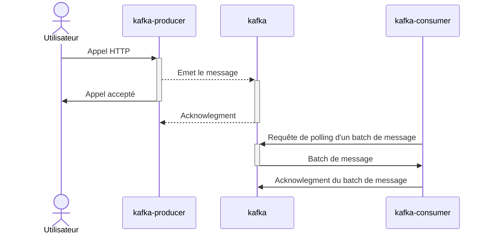

# 🚀spring-kafka

> Repository d'exemple d'utilisation de Spring Kafka

## 🎉 Bienvenue

Ce repository a pour but de montrer **simplement** comment produire et consommer (à venir) des messages provenant de la plateforme Confluent Kafka. 
Il vous permettra aussi de configurer rapidement votre projet en vous appuyant sur: 

> - Le fichier [compose.yaml](compose.yaml)
>   - Permet de monter une infra Confluent Kafka en mode Kraft
>   - Créé automatiquement un topic au démarrage des conteneurs
>   - Configure automatique le schema AVRO au démarrage des conteneur en utilisant une Schema Registry
> - Avoir des exemples de tests d'intégration

## 🍳 Composition du repository

📖 Un premier "module", **schema**, contient une définition de schema AVRO: [README.md](schema/README.md) 
📤 Un second "module", **kafka-producer**, expose une API REST et permet de publier un message sur la plateforme Confluent Kafka 🙂: [README.md](kafka-producer/README.md) 
📥 Un troisième "module", **kafka-consumer**, permet de consommer les messages publiés par le **kafka-producer** : [README.md](kafka-consumer/README.md) 

## 🛣️ Diagramme de séquence

## ✍️ Travaux à venir

- Réalisation d'une application Spring Kafka Streams entre le producer et le consumer 📬
- Démonstration avec Testcontainers
- Autres idées ❓