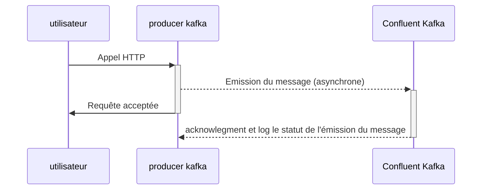

# 📤 kafka-producer

## 🚀Utilisation de l'application

Pour essayer l'application, vous devez au préalable **déployer le schéma AVRO** sur votre repo maven local: [README.md](../schema/README.md)<br/>

Packagez l'application:
```shell
mvn clean package
```

Monter l'infra docker:
```shell
docker compose -f ../compose.yaml up
```

Vous pourrez alors démarrer l'application avec le profil **_"dev"_** <br/>
Le fichier [request.http](request.http) permet de requêter l'API exposer pour émettre un évènement via Kafka.

Si vous possédez une licence Intellij, vous pourrez observer les messages émis grâce au [plugin Kafka](https://www.jetbrains.com/help/idea/2024.2/big-data-tools-kafka.html?big.data.tools.kafka&utm_source=product&utm_medium=link&utm_campaign=IU&utm_content=2024.2&keymap=macOS+copy+2#connect_to_kafka_cloud)

## 🕵️‍♀️ Diagramme de séquence
